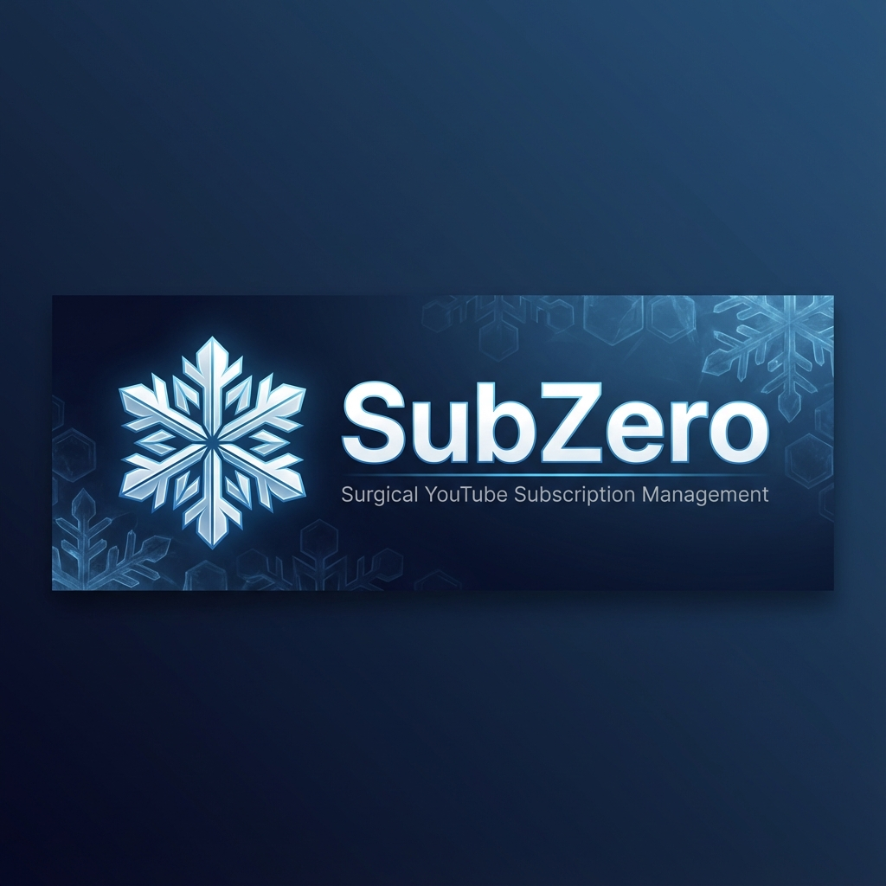

<div align="center">
    <a href="https://github.com/Zendevve/SubZero" target="_blank">
        
    </a>
</div>

<div align="center">

[![PRG Gold](https://img.shields.io/badge/PRG-Gold_Project-FFD700?style=for-the-badge&logo=data:image/svg%2bxml;base64,PD94bWwgdmVyc2lvbj0iMS4wIiBzdGFuZGFsb25lPSJubyI/Pgo8IURPQ1RZUEUgc3ZnIFBVQkxJQyAiLS8vVzNDLy9EVEQgU1ZHIDIwMDEwOTA0Ly9FTiIKICJodHRwOi8vd3d3LnczLm9yZy9UUi8yMDAxL1JFQy1TVkctMjAwMTA5MDQvRFREL3N2ZzEwLmR0ZCI+CjxzdmcgdmVyc2lvbj0iMS4wIiB4bWxucz0iaHR0cDovL3d3dy53My5vcmcvMjAwMC9zdmciCiB3aWR0aD0iMjYuMDAwMDAwcHQiIGhlaWdodD0iMzQuMDAwMDAwcHQiIHZpZXdCb3g9IjAgMCAyNi4wMDAwMDAgMzQuMDAwMDAwIgogcHJlc2VydmVBc3BlY3RSYXRpbz0ieE1pZFlNaWQgbWVldCI+Cgo8ZyB0cmFuc2Zvcm09InRyYW5zbGF0ZSgwLjAwMDAwMCwzNC4wMDAwMDApIHNjYWxlKDAuMTAwMDAwLC0wLjEwMDAwMCkiCmZpbGw9IiNGRkQ3MDAiIHN0cm9rZT0ibm9uZSI+CjxwYXRoIGQ9Ik0xMiAzMjggYy04IC04IC0xMiAtNTEgLTEyIC0xMzUgMCAtMTA5IDIgLTEyNSAxOSAtMTQwIDQyIC0zOCA0OAotNDIgNTkgLTMxIDcgNyAxNyA2IDMxIC0xIDEzIC03IDIxIC04IDIxIC0yIDAgNiAyOCAxMSA2MyAxMyBsNjIgMyAwIDE1MCAwCjE1MCAtMTE1IDMgYy04MSAyIC0xMTkgLTEgLTEyOCAtMTB6IG0xMDIgLTc0IGMtNiAtMzMgLTUgLTM2IDE3IC0zMiAxOCAyIDIzCjggMjEgMjUgLTMgMjQgMTUgNDAgMzAgMjUgMTQgLTE0IC0xNyAtNTkgLTQ4IC02NiAtMjAgLTUgLTIzIC0xMSAtMTggLTMyIDYKLTIxIDMgLTI1IC0xMSAtMjIgLTE2IDIgLTE4IDEzIC0xOCA2NiAxIDc3IDAgNzIgMTggNzIgMTMgMCAxNSAtNyA5IC0zNnoKbTExNiAtMTY5IGMwIC0yMyAtMyAtMjUgLTQ5IC0yNSAtNDAgMCAtNTAgMyAtNTQgMjAgLTMgMTQgLTE0IDIwIC0zMiAyMCAtMTgKMCAtMjkgLTYgLTMyIC0yMCAtNyAtMjUgLTIzIC0yNiAtMjMgLTIgMCAyOSA4IDMyIDEwMiAzMiA4NyAwIDg4IDAgODggLTI1eiIvPgo8L2c+Cjwvc3ZnPgo=)](https://github.com/Zendevve/SubZero)
[](https://www.typescriptlang.org/)
[](https://react.dev/)
[](https://developer.chrome.com/docs/extensions/mv3/)
[](LICENSE)

</div>

---------------

# SubZero

**Surgical YouTube Subscription Management** — A Chrome Extension that identifies inactive channels and enables bulk unsubscription without touching the YouTube Data API.

<div align="center">
    
</div>

---------------

## Table of Contents

- [Features](#features)
- [Background Story](#background-story)
- [Getting Started](#getting-started)
  - [Dependencies](#dependencies)
  - [Installation](#installation)
- [What's Inside?](#whats-inside)
- [Architecture](#architecture)
- [What's Next?](#whats-next)
- [Resources](#resources)
- [License](#license)
- [Credits](#credits)

## Features

🧊 **Smart Inactivity Detection**
- Scans channels via RSS feeds (no API quota needed)
- Classifies channels: Ghost (>1yr), Dormant (>6mo), Active

⚡ **Blazing Fast Dashboard**
- Virtualized list handles 5,000+ subscriptions
- Real-time filtering by activity status
- Search by channel name or handle

🎯 **Surgical Unsubscription**
- Bulk selection with checkboxes
- Human-like timing with jitter (anti-detection)
- MutationObserver for confirmation modal handling

🔒 **Privacy First**
- Runs entirely in your browser
- No data sent to external servers
- No YouTube Data API calls for write operations

## Background Story

YouTube's subscription page has become a graveyard of abandoned channels. Managing 500+ subscriptions manually is a nightmare, and the official YouTube Data API charges 50 quota units per unsubscribe—making bulk cleanup economically impossible.

**SubZero** solves this by:
1. Extracting subscription data directly from `ytInitialData` (free, fast, complete)
2. Checking channel activity via unadvertised RSS feeds (no API, no quota)
3. Automating the unsubscribe action with human-like timing (DOM automation)

The result: a surgical tool that cleanses your subscription list while staying under YouTube's radar.

## Getting Started

### Dependencies

- [Node.js](https://nodejs.org/) v18+
- [pnpm](https://pnpm.io/) or npm
- Google Chrome (or Chromium-based browser)

### Installation

**Developer Mode (from source):**

```bash
# Clone the repository
git clone https://github.com/Zendevve/SubZero.git
cd SubZero

# Install dependencies
npm install

# Build the extension
npm run build

# Load in Chrome:
# 1. Open chrome://extensions/
# 2. Enable "Developer mode"
# 3. Click "Load unpacked"
# 4. Select the `dist/` folder
```

**Usage:**

1. Navigate to `youtube.com/feed/channels`
2. Click the **🧊 SubZero** button
3. Dashboard opens with your subscriptions
4. Click **Scan Inactivity** to check channel activity
5. Filter by "Ghosts" or "Dormant"
6. Select channels and click **Unsubscribe**

## What's Inside?

```
SubZero/
├── docs/
│   ├── Features/           # Feature specifications
│   ├── ADR/                 # Architecture Decision Records
│   ├── Testing/             # Test strategy
│   ├── Development/         # Setup guides
│   └── images/              # Brand assets
├── src/
│   ├── background/          # MV3 Service Worker
│   ├── content/             # Content script + Main World injector
│   ├── dashboard/           # React dashboard UI
│   ├── lib/                 # Core logic (db, rate-limiter, RSS parser)
│   ├── types/               # TypeScript interfaces
│   └── constants/           # Centralized constants
├── public/                  # Static assets (icons)
├── manifest.json            # Chrome Extension Manifest V3
├── AGENTS.md                # MCAF rules for AI agents
└── README.md                # You are here
```

## Architecture

SubZero uses a 3-tier architecture:

| Tier | Component | Description |
|------|-----------|-------------|
| 1 | **ytInitialData Extraction** | Content script reads subscription data from YouTube's internal JSON |
| 2 | **RSS Inactivity Heuristic** | Rate-limited RSS fetches determine channel activity status |
| 3 | **DOM Automation** | Simulated clicks with MutationObserver for unsubscribe confirmation |

See [ADR-001](docs/ADR/ADR-001-ytInitialData-extraction.md), [ADR-002](docs/ADR/ADR-002-rss-inactivity-heuristic.md), [ADR-003](docs/ADR/ADR-003-dom-automation.md) for architectural decisions.

## What's Next?

- [ ] Progress indicator during bulk unsubscribe
- [ ] Safelist feature (⭐ protect favorite channels)
- [ ] Export subscription data (CSV/JSON)
- [ ] Dark/light theme toggle
- [ ] Chrome Web Store release

## Resources

- [Chrome Extension Manifest V3](https://developer.chrome.com/docs/extensions/mv3/)
- [CRXJS Vite Plugin](https://crxjs.dev/vite-plugin)
- [Dexie.js (IndexedDB)](https://dexie.org/)
- [TanStack Virtual](https://tanstack.com/virtual/latest)
- [MCAF Framework](https://mcaf.managed-code.com/)

## License

This project is licensed under the [GNU General Public License v3.0](LICENSE).

---------------

## Credits

**Author:** [Zendevve](https://github.com/Zendevve)

---------------

<div align="center">
    <a href="https://github.com/Zendevve/SubZero" target="_blank">
        
    </a>
</div>
