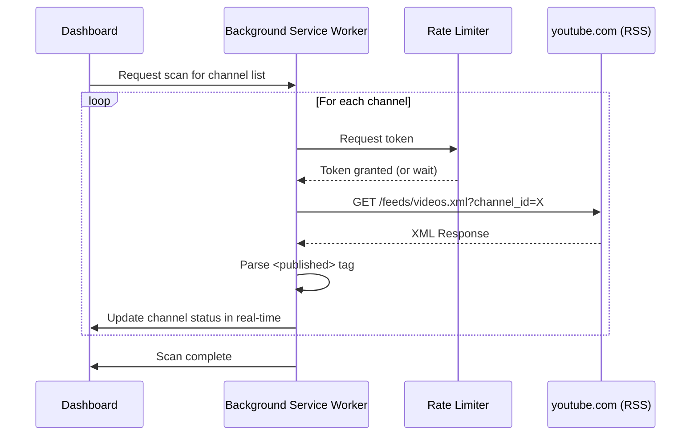

# Feature: Inactivity Scan (RSS Heuristic)

**Status**: Proposed
**Owner**: Dev
**Related ADRs**: [ADR-002](../ADR/ADR-002-rss-inactivity-heuristic.md)

---

## Purpose

Identify "dead" or "dormant" channels by fetching their RSS feeds to determine the last upload date, without incurring YouTube Data API quota costs.

---

## Business Rules

1.  The system MUST fetch the RSS feed from `youtube.com/feeds/videos.xml?channel_id=...`.
2.  Fetches MUST be rate-limited using a Leaky Bucket algorithm (5 tokens/sec, 20 capacity).
3.  A channel is classified as:
    - **Ghost**: No upload in > 1 year.
    - **Dormant**: No upload in > 6 months.
    - **Active**: Uploaded in the last 30 days.
4.  RSS fetch results MUST be cached in IndexedDB.

---

## Main Flow

---

## Edge Cases

| Case                       | Expected Behavior                                      |
| -------------------------- | ------------------------------------------------------ |
| Channel has 0 videos       | Status: "No Videos". `lastUpload` = null.              |
| RSS fetch returns 404      | Status: "Feed Not Found". Channel may be deleted.      |
| RSS fetch times out        | Retry 2x, then Status: "Unknown".                      |
| Rate limit triggered (429) | Pause all fetches for 60 seconds, then resume.         |

---

## Test Flows

### Positive

| ID     | Scenario                       | Expected Result                                |
| ------ | ------------------------------ | ---------------------------------------------- |
| TST-01 | Active channel                 | `lastUpload` < 30 days, Status: "Active".      |
| TST-02 | Dormant channel                | `lastUpload` > 6 months, Status: "Dormant".    |
| TST-03 | Ghost channel                  | `lastUpload` > 1 year, Status: "Ghost".        |

### Negative

| ID     | Scenario                       | Expected Result                                |
| ------ | ------------------------------ | ---------------------------------------------- |
| TST-04 | RSS returns 404                | Status: "Feed Not Found".                      |
| TST-05 | Network timeout                | Retry, then Status: "Unknown".                 |

---

## Definition of Done

- [ ] Service Worker fetches RSS for all channels.
- [ ] Leaky Bucket rate limiter limits requests to ~5/sec.
- [ ] `lastUpload` date is parsed and stored in IndexedDB.
- [ ] Dashboard UI updates in real-time as scan progresses.
- [ ] All test flows pass.
