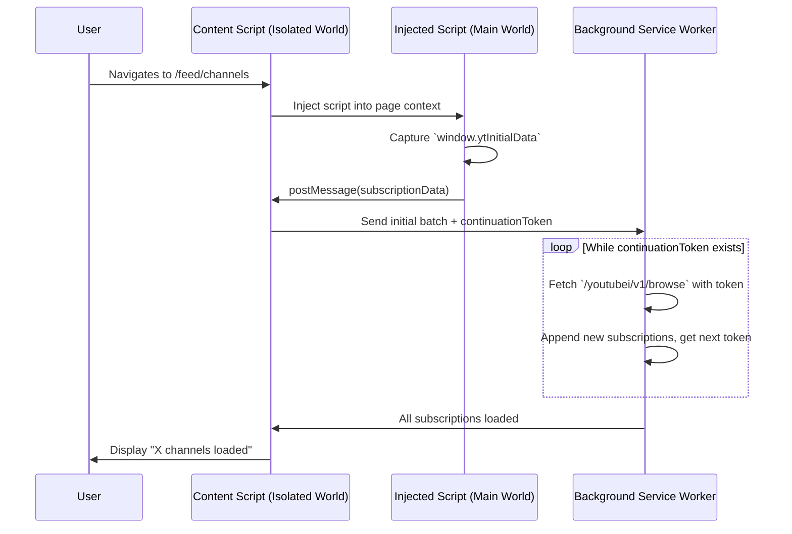

# Feature: Subscription Data Ingestion

**Status**: Proposed
**Owner**: Dev
**Related ADRs**: [ADR-001](../ADR/ADR-001-ytInitialData-extraction.md)

---

## Purpose

Load the user's complete list of YouTube subscriptions quickly and reliably by extracting data directly from YouTube's internal `ytInitialData` object, bypassing slow and fragile DOM scraping.

---

## Business Rules

1.  The system MUST load 5,000+ subscriptions in under 30 seconds.
2.  The system MUST NOT rely on visible HTML elements for data.
3.  The system MUST handle pagination via `continuationToken`.

---

## Main Flow

---

## Edge Cases

| Case                          | Expected Behavior                                     |
| ----------------------------- | ----------------------------------------------------- |
| User has 0 subscriptions      | Display "You have no subscriptions."                  |
| Network error during fetch    | Retry 3 times, then display "Partial load. X found."  |
| `ytInitialData` structure changes | Log error, notify user, pause and await manual update. |

---

## Test Flows

### Positive

| ID     | Scenario                      | Expected Result                               |
| ------ | ----------------------------- | --------------------------------------------- |
| TST-01 | User with 50 subs             | All 50 loaded in < 5 seconds.                 |
| TST-02 | User with 5000 subs           | All 5000 loaded in < 30 seconds.              |
| TST-03 | Pagination loop               | Continuation tokens are followed until empty. |

### Negative

| ID     | Scenario                      | Expected Result                               |
| ------ | ----------------------------- | --------------------------------------------- |
| TST-04 | `ytInitialData` is missing    | Error message: "Could not read page data."    |
| TST-05 | `/browse` endpoint returns 5xx | Retry 3x, then partial load with warning.     |

---

## Definition of Done

- [ ] Content script successfully extracts `ytInitialData` on `/feed/channels`.
- [ ] Service Worker fetches all pages using continuation tokens.
- [ ] All subscriptions are stored in IndexedDB (Dexie).
- [ ] UI displays a loading progress indicator.
- [ ] All positive and negative test flows pass.
